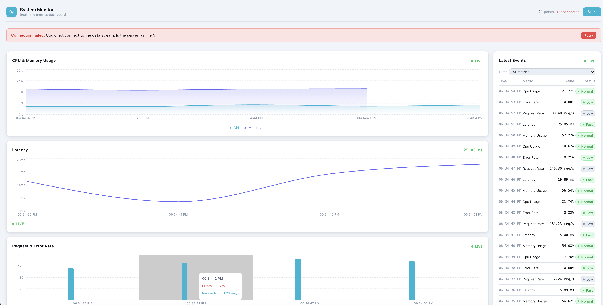
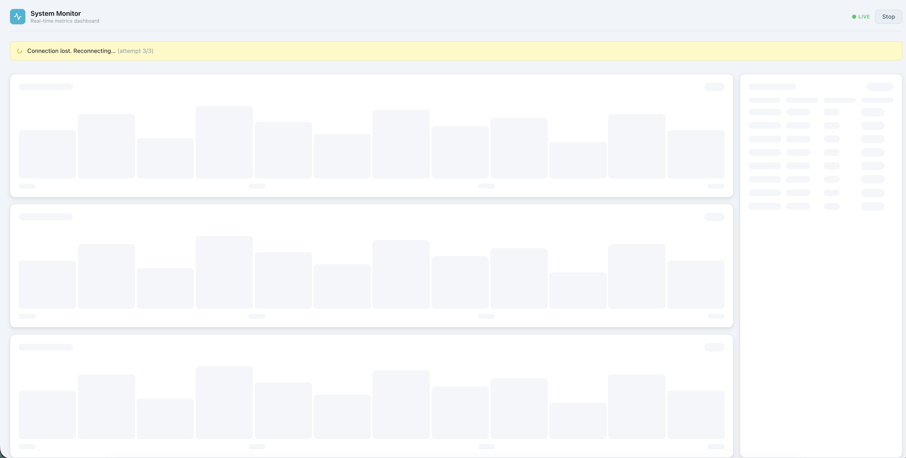
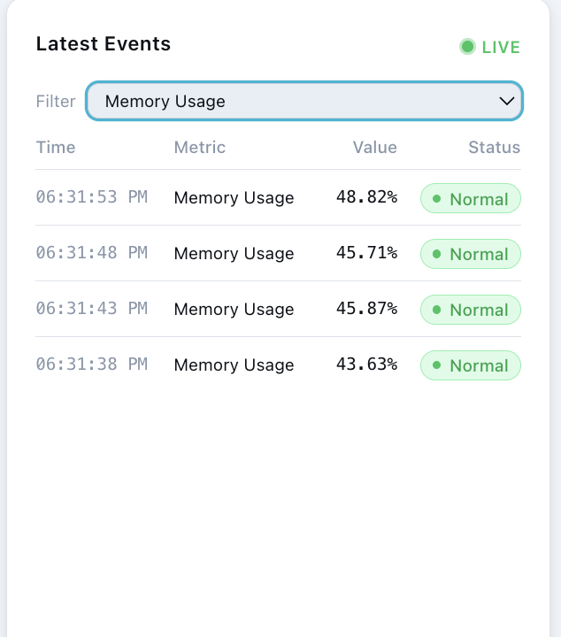

# System Monitor — Real-Time Streaming Dashboard

A production-grade real-time metrics dashboard built with React, TypeScript, and Server-Sent Events. Visualizes live system metrics including CPU usage, memory, latency, request rate, and error rate.



---

## Features

- **Live streaming** via Server-Sent Events (SSE) — no polling
- **3 chart types** — Area (CPU/Memory), Line (Latency), Bar (Request/Error Rate)
- **Live events table** with per-metric filter and status badges
- **Skeleton loading state** — zero layout shift when data arrives
- **Connection resilience** — auto-reconnects up to 3 times on failure with status banner
- **Start / Stop** stream control
- **Responsive layout** — works on desktop and mobile
- **29 unit tests** across utilities, hooks, and components

---

## Screenshots

### Dashboard — live data


### Loading & reconnection state


### Table with filter applied


---

## Setup

### Prerequisites
- Node.js 18+
- npm 9+

### Install & Run

```bash
# 1. Install dependencies
npm install

# 2. Install server dependencies
cd server && npm install && cd ..

# 3. Start both frontend and backend
npm run dev
```

| Service | URL |
|---|---|
| Frontend | http://localhost:5173 |
| SSE Server | http://localhost:3001 |

### Run Tests

```bash
npm test
```

### Production Build

```bash
npm run build
```

---

## Data Stream

The mock server emits one data point per second, rotating through 5 metrics:

```json
{
  "id": 42,
  "timestamp": "2025-11-06T12:30:00Z",
  "metric": "cpu_usage",
  "unit": "%",
  "value": 73.5
}
```

| Metric | Range | Unit |
|---|---|---|
| `cpu_usage` | 10–95 | % |
| `memory_usage` | 30–90 | % |
| `latency` | 5–300 | ms |
| `request_rate` | 50–500 | req/s |
| `error_rate` | 0–15 | % |

Values use a **random walk** algorithm — each tick nudges the previous value slightly so changes look natural.

---

## Architecture

```
src/
├── features/
│   └── live-dashboard/
│       ├── components/       # Chart, table, header, banners, skeletons
│       ├── hooks/
│       │   ├── useSSE.ts     # SSE connection, rolling window, retry logic
│       │   └── useMetrics.ts # Slices data per metric using useMemo
│       ├── utils/
│       │   └── formatters.ts # Pure formatting functions
│       ├── __tests__/        # Unit & component tests
│       └── constants.ts      # SSE_URL, MAX_HISTORY, metric definitions
├── services/
│   └── stream.ts             # EventSource wrapper with typed error handling
├── shared/
│   └── ui/                   # Card, Badge, Skeleton, StatusDot, ErrorBoundary
└── types/
    └── index.ts              # DataPoint, MetricName, ConnectionStatus
server/
└── src/
    └── index.ts              # Express SSE server
```

### Key Design Decisions

**SSE over WebSocket** — one-directional server→client stream; SSE is simpler, natively supported, and auto-reconnects in the browser.

**`useSSE` + `useMetrics` split** — `useSSE` owns the connection and raw data; `useMetrics` owns data slicing. Swapping the transport layer (e.g. to WebSocket) requires touching only `useSSE`.

**Rolling window cap (100 points)** — `data.slice(1)` on every new point keeps memory bounded and chart render time constant regardless of how long the dashboard runs.

**`useMemo` on metric filters** — prevents re-filtering all 100 points on every unrelated re-render (e.g. filter dropdown state changes).

**Auto-retry with backoff** — `useSSE` retries up to 3 times (3s delay) before giving up. A `stoppedRef` prevents retry loops when the user explicitly stops the stream.

**Skeleton loading** — components render `ChartSkeleton` / `TableSkeleton` (same card dimensions as real content) until first data arrives — no layout shift.

**Class-based `ErrorBoundary`** — built-in React error boundary wraps the entire dashboard; catches render errors without a third-party library.

---

## Tech Stack

| | |
|---|---|
| Framework | React 19 + TypeScript |
| Build | Vite 8 |
| Styling | TailwindCSS v4 |
| Charts | Recharts |
| Testing | Vitest + Testing Library |
| Server | Express (Node.js) |

---

## Time Spent

~ 7–8 hours